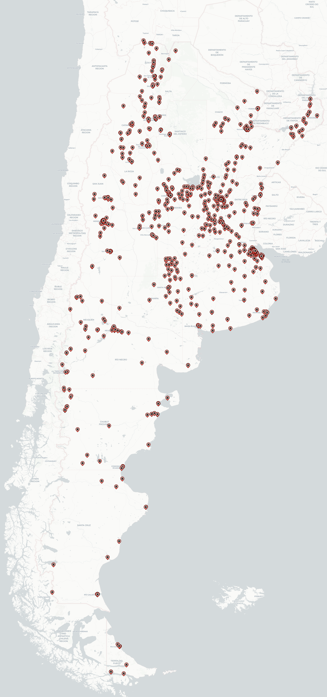
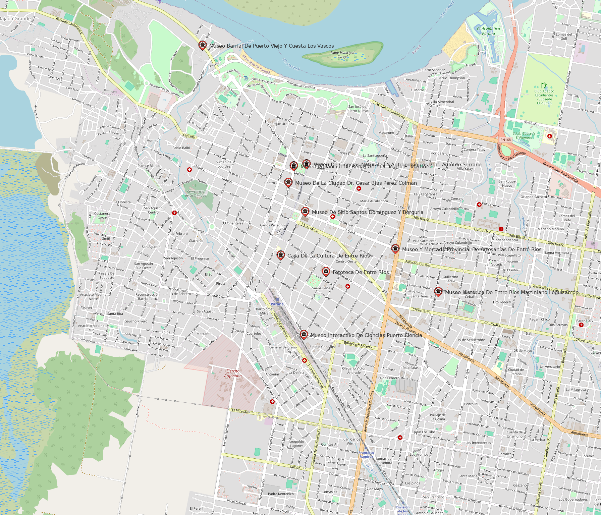
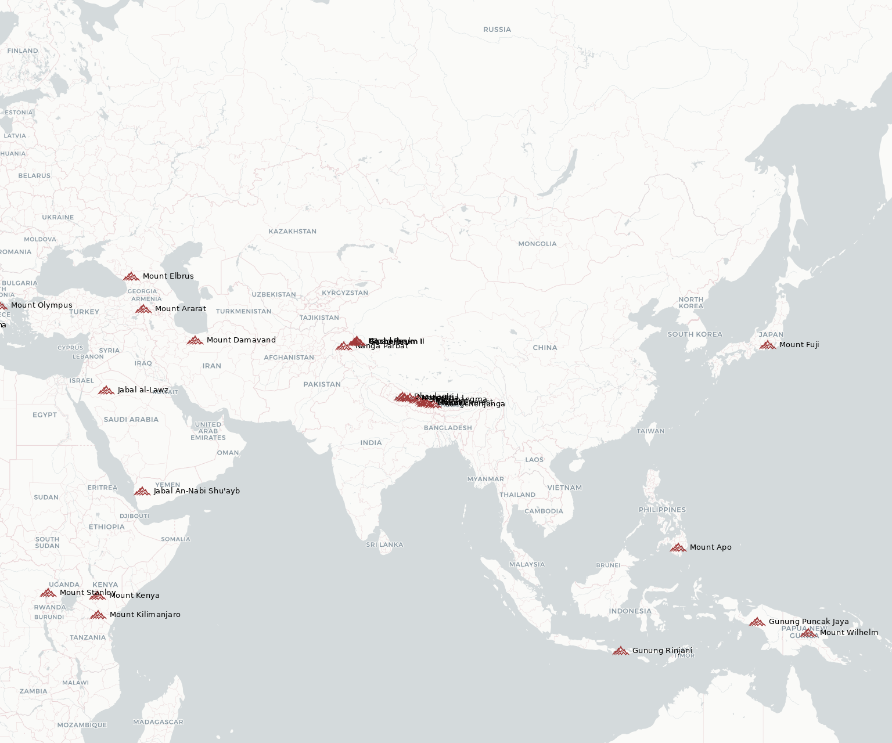
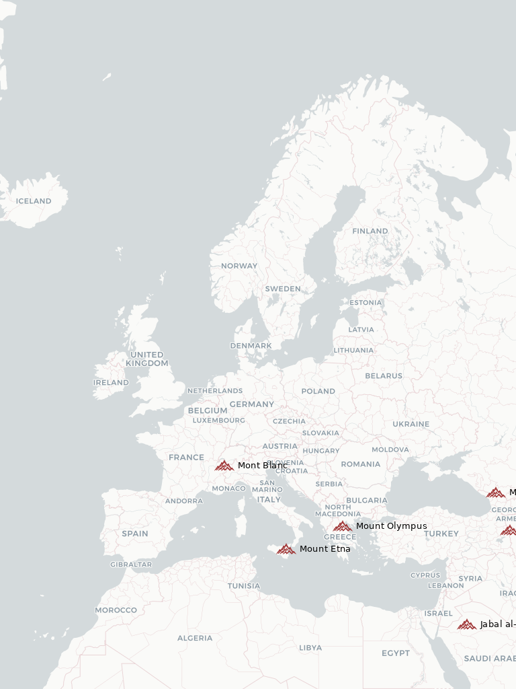
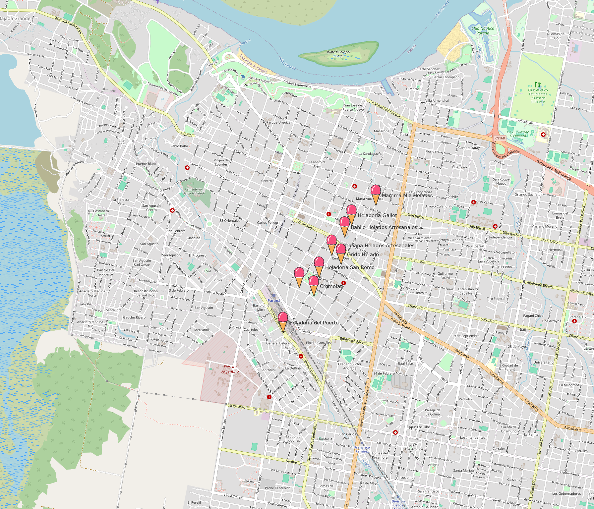
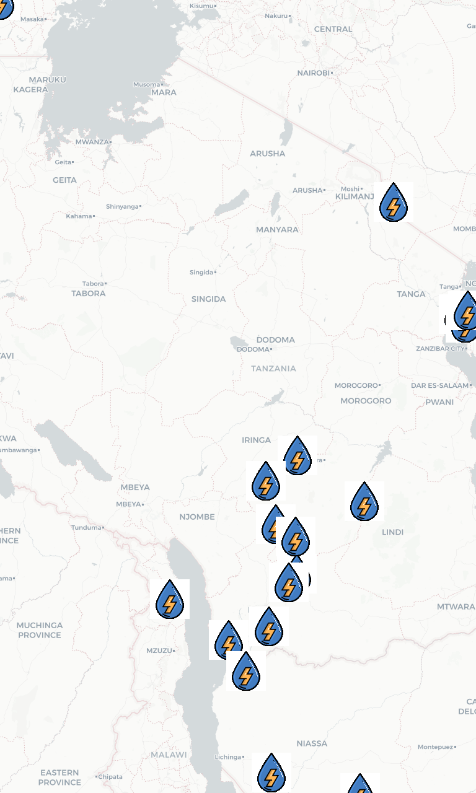

# LibGD-GIS

<p align="center">
  <a href="https://rubystacknews.com/2026/01/07/ruby-can-now-draw-maps-and-i-started-with-ice-cream/">
    
  </a>
  <a href="https://x.com/ruby_stack_news">
    
  </a>
  <a href="https://www.linkedin.com/in/germ%C3%A1n-silva-56a12622/">
    
  </a>
</p>

<p align="center">
  <a href="https://rubygems.org/gems/libgd-gis">
    
  </a>
  <a href="https://github.com/ggerman/libgd-gis">
    
  </a>
  <a href="https://github.com/ggerman/ruby-libgd">
    
  </a>
</p>

<p align="right">
  
</p>


| Examples | Examples | Examples |
| :----: | :----: | :--: |
|  |  |  |
|  |  |  |
|  |  |  |

---

## A geospatial raster engine for Ruby.

libgd-gis allows Ruby to render real maps, GeoJSON layers, vector features, and geospatial tiles using a native raster backend powered by **libgd**.

It restores something Ruby lost over time:
 the ability to generate **maps, tiles, and GIS-grade visualizations natively**, without relying on external tools like QGIS, Mapnik, ImageMagick, or Mapbox.

Built on top of **ruby-libgd**, this project turns Ruby into a **map rendering engine**, capable of producing spatial graphics, tiled maps, and geospatial outputs directly inside Ruby processes.

- No external renderers.
-  No shelling out.
-  Just Ruby, raster, and GIS.

---

## What is this?

`libgd-gis` is a **geospatial rendering engine** for Ruby built on top of [`ruby-libgd`](https://github.com/ggerman/ruby-libgd).

It allows you to:

- Load GeoJSON, CSV, or any dataset with coordinates  
- Fetch real basemap tiles  
- Reproject WGS84 (lat/lon) into Web Mercator  
- Render points, icons, and layers onto a raster map  
- Generate PNG maps or map tiles  

This is the same type of pipeline used by professional GIS systems — implemented in Ruby.

---

## Installation

### System dependency

`libgd-gis` depends on **libgd**, via `ruby-libgd`.

Install libgd first:

**Ubuntu / Debian**
```
sudo apt install libgd-dev
```

**macOS**
```
brew install gd
```

---

### Ruby gems

```
gem install ruby-libgd
gem install libgd-gis
```

---

## Quick Example

Render hydroelectric plants from a GeoJSON file:

```ruby
require "json"
require "gd/gis"

# ---------------------------
# Bounding box mundial
# ---------------------------
AMERICA = [-170, -60, -30, 75]

# ---------------------------
# Crear mapa
# ---------------------------
map = GD::GIS::Map.new(
  bbox: AMERICA,
  zoom: 4,
  basemap: :carto_light
)

# Cargar datos
# ---------------------------
peaks = JSON.parse(File.read("picks.json"))

# ---------------------------
# Agregar capa de puntos
# ---------------------------
map.add_points(
  peaks,
  lon: ->(p) { p["longitude"] },
  lat: ->(p) { p["latitude"] },
  icon: "peak.png",
  label: ->(p) { p["name"] },
  font: "./fonts/DejaVuSans.ttf",
  size: 10,
  color: [0,0,0]
)

# ---------------------------
# Renderizar y guardar
# ---------------------------
map.render
map.save("output/america.png")

puts "Saved output/america.png"

```

---

## Features

- Real basemap tiles  
- WGS84 → Web Mercator projection  
- GeoJSON point rendering  
- CSV / JSON support  
- Icon-based symbol layers  
- Automatic bounding box fitting  
- Raster output (PNG)  

---

## License

MIT

---

## Author

Germán Silva
https://github.com/ggerman
https://rubystacknews.com
