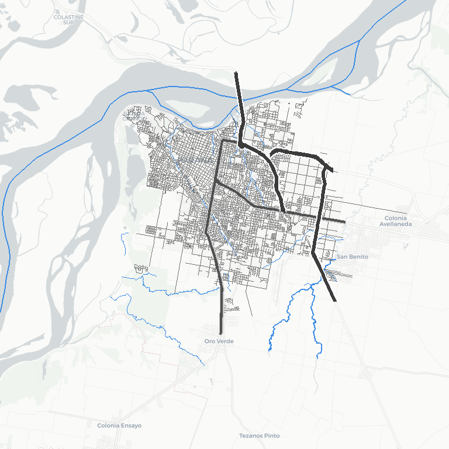
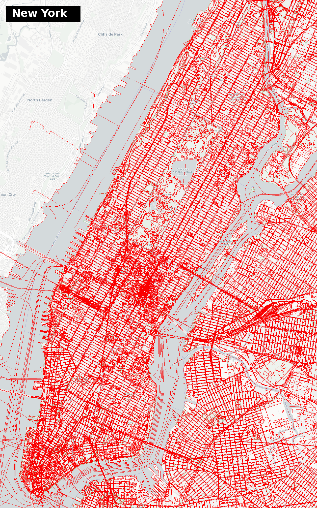
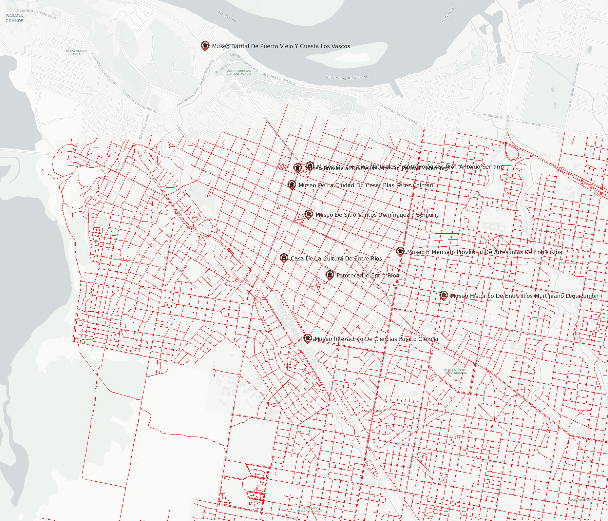
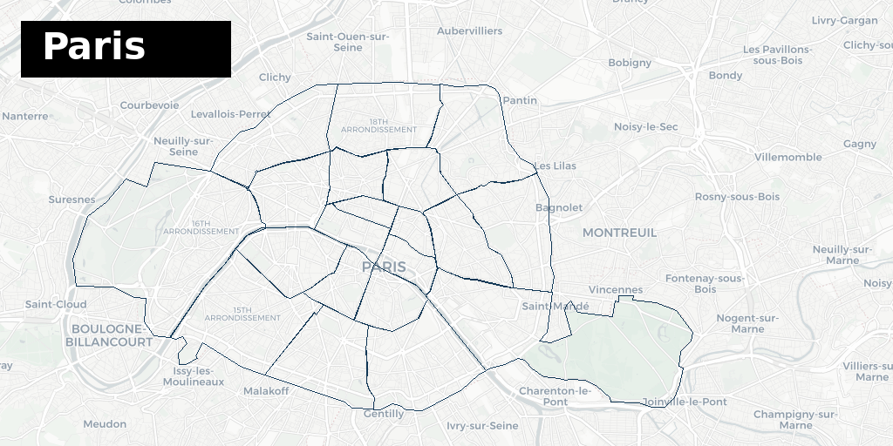

# LibGD-GIS

<p align="center">
  <a href="https://rubystacknews.com/2026/01/07/ruby-can-now-draw-maps-and-i-started-with-ice-cream/">
    
  </a>
  <a href="https://x.com/ruby_stack_news">
    
  </a>
  <a href="https://www.linkedin.com/in/germ%C3%A1n-silva-56a12622/">
    
  </a>
</p>

<p align="center">
  <a href="https://rubygems.org/gems/libgd-gis">
    
  </a>
  <a href="https://github.com/ggerman/libgd-gis">
    
  </a>
  <a href="https://github.com/ggerman/ruby-libgd">
    
  </a>
</p>

<p align="right">
  
</p>


[](https://www.codacy.com/app/libgd-gis/libgd-gis?utm_source=github.com&amp;utm_medium=referral&amp;utm_content=libgd-gis/libgd-gis&amp;utm_campaign=Badge_Grade)
[](https://coveralls.io/github/libgd-gis/libgd-gis?branch=master)
[](https://rubygems.org/gems/libgd-gis)


| Examples | Examples | Examples |
| :----: | :----: | :--: |
|  |  |  |
|  |  |  |
|  |  |  |
|  |  |  |
|  |  |  |
|  |  |  |

---

> **libgd-gis is evolving very fast**, so some examples may temporarily stop working.  
> Please report issues or ask for help — feedback is very welcome.  
> https://github.com/ggerman/libgd-gis/issues or ggerman@gmail.com

--

## A geospatial raster engine for Ruby.

libgd-gis allows Ruby to render real maps, GeoJSON layers, vector features, and geospatial tiles using a native raster backend powered by **libgd**.

It restores something Ruby lost over time:
 the ability to generate **maps, tiles, and GIS-grade visualizations natively**, without relying on external tools like QGIS, Mapnik, ImageMagick, or Mapbox.

Built on top of **ruby-libgd**, this project turns Ruby into a **map rendering engine**, capable of producing spatial graphics, tiled maps, and geospatial outputs directly inside Ruby processes.

- No external renderers.
-  No shelling out.
-  Just Ruby, raster, and GIS.

---

## What is this?

`libgd-gis` is a **geospatial rendering engine** for Ruby built on top of [`ruby-libgd`](https://github.com/ggerman/ruby-libgd).

It allows you to:

- Load GeoJSON, CSV, or any dataset with coordinates  
- Fetch real basemap tiles  
- Reproject WGS84 (lat/lon) into Web Mercator  
- Render points, icons, and layers onto a raster map  
- Generate PNG maps or map tiles  

This is the same type of pipeline used by professional GIS systems — implemented in Ruby.

---

## Installation

### System dependency

`libgd-gis` depends on **libgd**, via `ruby-libgd`.

Install libgd first:

**Ubuntu / Debian**
```
sudo apt install libgd-dev
```

**macOS**
```
brew install gd
```

---

### Ruby gems

```
gem install ruby-libgd
gem install libgd-gis
```

---

## Quick Example

Render hydroelectric plants from a GeoJSON file:

```ruby
# libgd-gis is evolving very fast, so some examples may temporarily stop working.
# Please report issues or ask for help — feedback is very welcome.
# https://github.com/ggerman/libgd-gis/issues or ggerman@gmail.com

require "gd/gis"
require "gd"

TOKYO = [139.68, 35.63, 139.82, 35.75]

map = GD::GIS::Map.new(
  bbox: TOKYO,
  zoom: 13,
  basemap: :esri_satellite
)

map.style = GD::GIS::Style.load("solarized")

map.add_geojson("railways.geojson")
map.add_geojson("parks.geojson")
map.add_geojson("wards.geojson")

map.render
map.save("tokyo.png")

# --------------------------
# Overlay label
# --------------------------

img = GD::Image.open("tokyo.png")

font = "../fonts/DejaVuSans-Bold.ttf"
text = "TOKYO"

x = 24
y = 24
w = 240
h = 64

# Fondo
img.filled_rectangle(x, y, x + w, y + h, [0,0,0])

# Texto
img.text(
  text,
  x: x + 24,
  y: y + 44,
  size: 32,
  color: [255,255,255],
  font: font
)

img.save("tokyo.png")


```
---
## Animations & Tracking (Alpha)

libgd-gis is designed not only for static map rendering, but also with a strong focus on
map manipulation and animated outputs.

One of its main goals is to enable animated map generation, including:

- Route and track visualization
- Step-by-step geospatial playback
- Simulated or real-time GPS tracking
- Time-based movement over geographic layers

This makes libgd-gis suitable for use cases such as real-time geolocation tracking,
mobility analysis, and geographic storytelling.

Animated map generation is already possible, including animated GIFs showing movement
across cities (e.g. Manhattan, Buenos Aires).

However, animation support is currently in **alpha (alpha-1)**.

The animation pipeline is under active development and will be released as a stable feature
only after extensive testing, performance optimization, and API stabilization.

During this phase:
- Animation-related APIs may change
- Examples may evolve
- Feedback and testing are highly encouraged

The long-term goal is to provide a reliable and deterministic geospatial animation engine,
fully integrated with the libgd-gis rendering pipeline and powered by ruby-libgd.

| Examples | Examples | Examples |
| :----: | :----: | :--: |
|  |  |  |
|  | | |

---

## Features

- Real basemap tiles  
- WGS84 → Web Mercator projection  
- GeoJSON point rendering  
- CSV / JSON support  
- Icon-based symbol layers  
- Automatic bounding box fitting  
- Raster output (PNG)  

---

## License

MIT

---

## Author

Germán Silva
https://github.com/ggerman
https://rubystacknews.com
