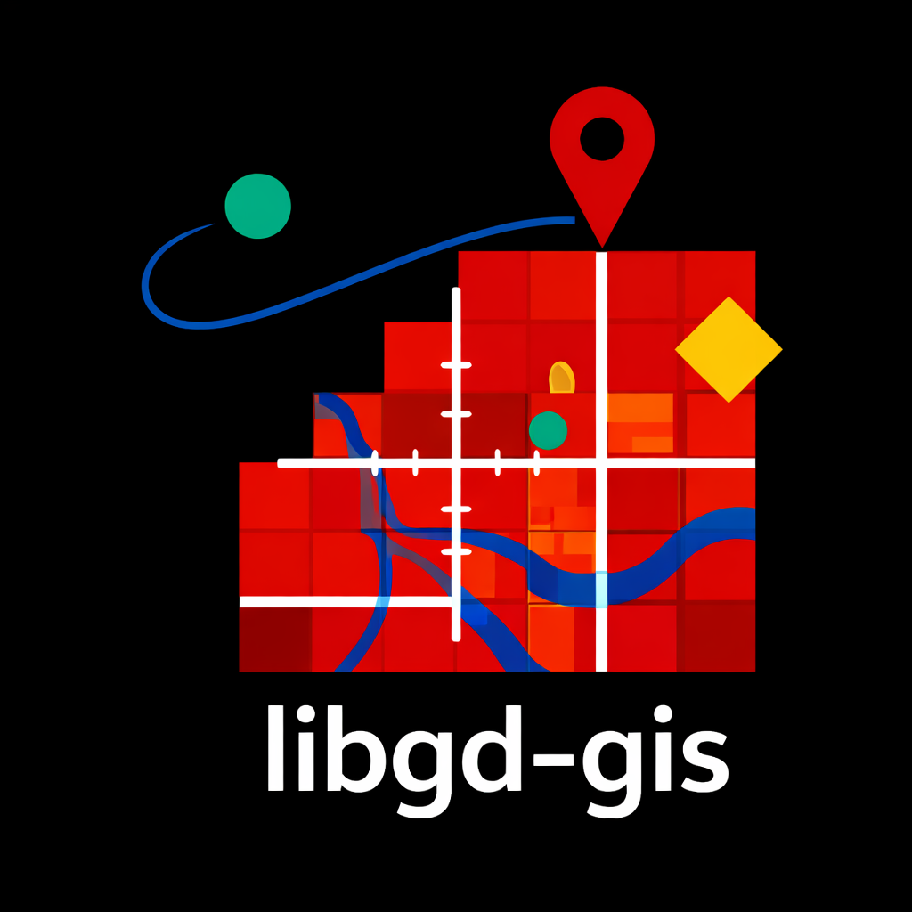

  

    
    libgd-gis
  

  

    <a href="index.html">← Documentation Index</a>
  

  

    <strong>Language:</strong>
    <a href="../en/index.html">🇬🇧 EN</a>
    <a href="es/index.html">🇪🇸 ES</a>
    <a href="../jp/index.html">🇯🇵 JP</a>
  

# libgd-gis — Renderizado de mapas estáticos para Ruby

`libgd-gis` es un **motor de render GIS estático para Ruby**, construido sobre  
**ruby-libgd** y la librería GD.

Transforma **datos geoespaciales (GeoJSON, coordenadas, capas)** en  
**imágenes raster de alta calidad**, con control total de estilos,
overlays y post-procesado.

**No es una librería de mapas interactivos**.  
Es un **motor de render**.

---

## Pipeline de render

libgd-gis sigue un pipeline claro:

1. Definir viewport y bounding box
2. Cargar un basemap
3. Aplicar un estilo (YAML)
4. Agregar capas geográficas
5. Renderizar el mapa
6. Post-procesar la imagen con ruby-libgd

---

## Viewport y configuración del mapa

| Archivo | Descripción |
|--------|-------------|
| [`new.md`](map_new.md) | Bounding box, zoom, tamaño de imagen y ajuste automático |

---

## Estilos (YAML)

| Archivo | Descripción |
|--------|-------------|
| [`styles.md`](styles.md) | Sistema de estilos YAML para capas GIS |

---

## Capas GeoJSON

| Archivo | Descripción |
|--------|-------------|
| [`add_geojson.md`](add_geojson.md) | Carga y renderizado de GeoJSON |

---

## Overlays (Geometría por código)

| Archivo | Descripción |
|--------|-------------|
| [`add_points.md`](add_points.md) | Puntos, POIs y etiquetas |
| [`add_lines.md`](add_lines.md) | Líneas, rutas y recorridos |
| [`add_polygons.md`](add_polygons.md) | Polígonos y áreas |

---

## Acceso a la imagen final

| Archivo | Descripción |
|--------|-------------|
| [`map_image.md`](map_image.md) | Acceso a `GD::Image` post-render |

---

## Filosofía de diseño

- Lógica GIS → libgd-gis  
- Manipulación de imagen → ruby-libgd  

---

## Nota de estabilidad

libgd-gis evoluciona rápidamente.

Reportar issues:
- https://github.com/ggerman/libgd-gis/issues
- ggerman@gmail.com
