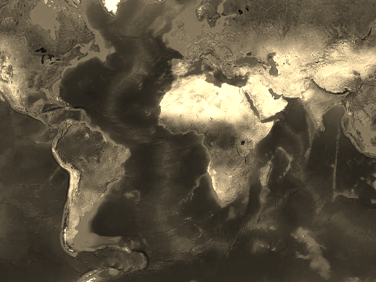
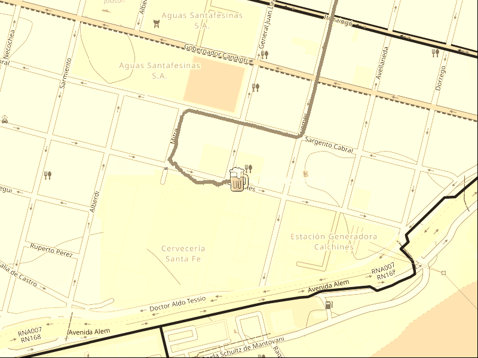

# map.image — Acceso a la imagen renderizada

Luego de renderizar un mapa, `libgd-gis` expone la imagen resultante a través de
`map.image`, devolviendo una instancia de `GD::Image`.

Esto permite post-procesar el mapa usando todas las capacidades de **ruby-libgd**.

---

## Uso básico

```ruby
map.render
img = map.image
```

`img` es un objeto `GD::Image`.

---

## ¿Qué se puede hacer con `map.image`?

Con acceso a la imagen podés:

- Dibujar texto y etiquetas
- Agregar overlays gráficos personalizados
- Usar transparencias y alpha blending
- Componer imágenes o íconos
- Guardar en distintos formatos (PNG, JPEG, GIF)

---

## Ejemplo: agregar una etiqueta luego del render

```ruby
img = map.image

font = "../fonts/DejaVuSans-Bold.ttf"

img.filled_rectangle(24, 24, 264, 88, [0, 0, 0])

img.text(
  "TOKYO",
  x: 48,
  y: 68,
  size: 32,
  color: [255, 255, 255],
  font: font
)

img.save("tokyo.png")
```

---

## ¿Por qué es importante el post-procesado?

- Mantiene el render GIS predecible
- Separa datos geográficos de presentación visual
- Facilita branding y composición avanzada
- Reutiliza conocimiento de ruby-libgd

---

## Relación con overlays

`map.image` complementa métodos como:

- `add_points`
- `add_lines`
- `add_polygons`

Usá overlays para datos geográficos y `map.image` para manipulación visual pura.

---

## Resumen

- `map.image` devuelve un `GD::Image`
- Acceso completo a ruby-libgd
- Ideal para labels y branding
- Separación clara GIS / imagen



