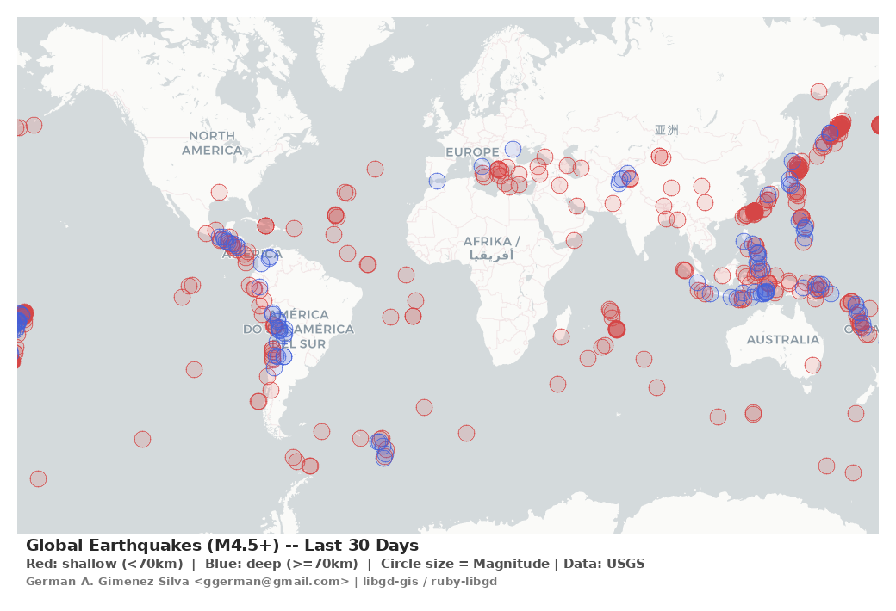
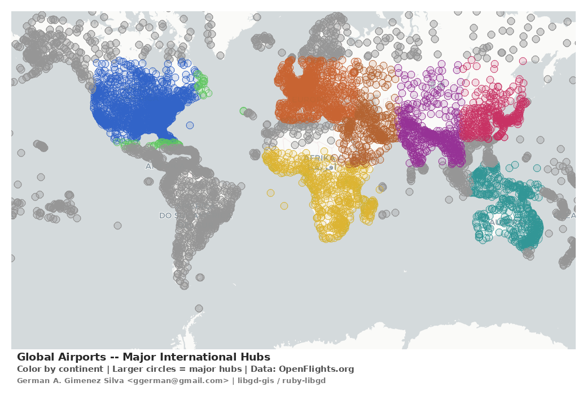
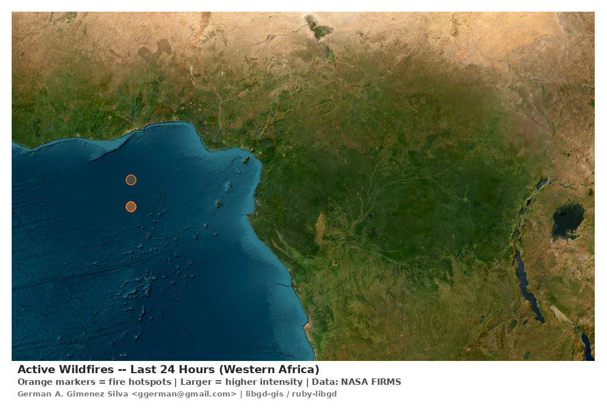

# Jupyter Notebook Examples for libgd-gis

This directory contains interactive Jupyter notebooks demonstrating real-world applications of `libgd-gis` for geospatial data visualization.

## 📓 Notebooks

### 1. `earthquakes_map.ipynb`
**Global Earthquakes (M4.5+)**

- **Data source**: USGS Earthquake API (live GeoJSON feed)
- **Visualization**: 
  - Red circles = shallow earthquakes (<70km depth)
  - Blue circles = deep earthquakes (≥70km depth)
  - Circle size scales with magnitude
- **Basemap**: Carto Light
- **Output**: Polaroid-style map with captions and credits



---

### 2. `airports_map.ipynb`
**Global Airports by Continent**

- **Data source**: OpenFlights.org (airport database)
- **Visualization**:
  - Color-coded by continent
  - Larger circles = major international hubs
  - IATA codes as labels
- **Basemap**: Carto Light
- **Output**: Polaroid-style map with legend and credits



---

### 3. `wildfires_map.ipynb`
**Active Wildfires (NASA FIRMS)**

- **Data source**: NASA FIRMS (MODIS satellite, last 24 hours)
- **Visualization**:
  - Orange markers indicate fire hotspots
  - Larger markers = higher thermal intensity
  - Focus on Western US region
- **Basemap**: ESRI Satellite imagery
- **Output**: Polaroid-style map with captions and credits



---

## 🚀 Requirements

To run these notebooks, you need:

```bash
# Install required gems
gem install ruby-libgd
gem install libgd-gis

# Install IRuby kernel
gem install iruby
iruby register
